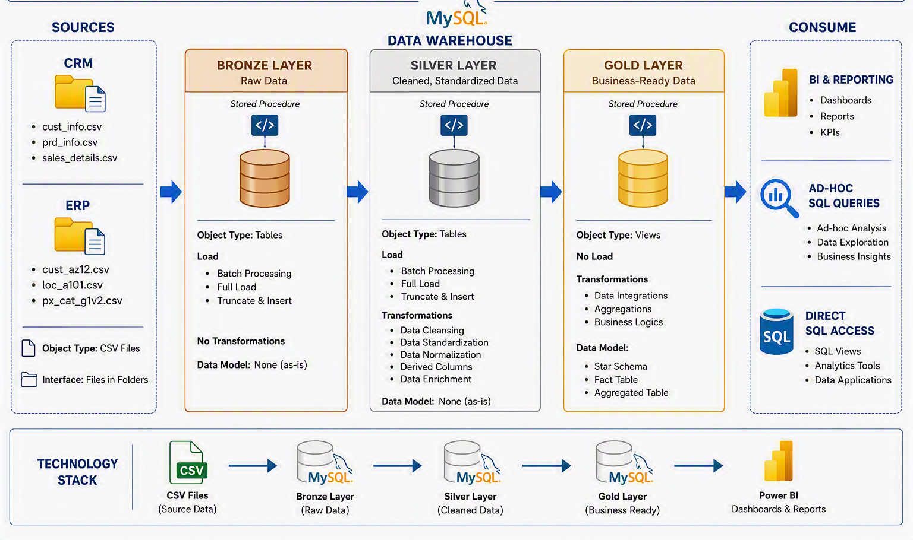

# SQL Data Warehouse Project

An end-to-end data warehouse built from raw CRM and ERP source files through a full **Bronze → Silver → Gold (Medallion Architecture)** pipeline in MySQL, feeding a Power BI reporting layer via ODBC.

This project covers the full lifecycle of a data warehouse: raw ingestion, data cleaning and standardization, dimensional modeling, data quality validation, and documentation — a repeatable, documented pipeline, not a single script.

---

## Architecture



- **Bronze** — raw data loaded exactly as extracted from source (CRM and ERP), untouched.
- **Silver** — cleaned, standardized, and deduplicated: consistent codes (gender, marital status, country, product line), validated dates, corrected price/quantity/sales inconsistencies.
- **Gold** — business-ready star schema (`dim_customers`, `dim_products`, `fact_sales`), built as views on top of Silver with surrogate keys, ready for reporting.

---
## 📖 Project Overview
This project involves:

Data Architecture: Designing a Modern Data Warehouse Using Medallion Architecture Bronze, Silver, and Gold layers.
ETL Pipelines: Extracting, transforming, and loading data from source systems into the warehouse.
Data Modeling: Developing fact and dimension tables optimized for analytical queries.
Analytics & Reporting: Creating SQL-based reports and dashboards for actionable insights.
🎯 This repository is an excellent resource for professionals and students looking to showcase expertise in:

SQL Development
Data Architect
Data Engineering
ETL Pipeline Developer
Data Modeling
Data Analytics

---
## 🚀 Project Requirements
Building the Data Warehouse (Data Engineering)
Objective
Develop a modern data warehouse using SQL Server to consolidate sales data, enabling analytical reporting and informed decision-making.

Specifications
Data Sources: Import data from two source systems (ERP and CRM) provided as CSV files.
Data Quality: Cleanse and resolve data quality issues prior to analysis.
Integration: Combine both sources into a single, user-friendly data model designed for analytical queries.
Scope: Focus on the latest dataset only; historization of data is not required.
Documentation: Provide clear documentation of the data model to support both business stakeholders and analytics teams.
BI: Analytics & Reporting (Data Analysis)
Objective
Develop SQL-based analytics to deliver detailed insights into:

Customer Behavior
Product Performance
Sales Trends
These insights empower stakeholders with key business metrics, enabling strategic decision-making.

---
## Repository Structure

```
sql-data-warehouse-project/
├── Dataset/
│   ├── source_crm/
│   │   ├── cust_info.csv
│   │   ├── prd_info.csv
│   │   └── sales_details.csv
│   └── source_erp/
│       ├── CUST_AZ12.csv
│       ├── LOC_A101.csv
│       └── PX_CAT_G1V2.csv
├── documents/
│   ├── Naming_Conventions.docx
│   ├── gold_layer_data_catalog.docx
|   ├── data_modling.png
│   ├── data_flow_bronze_silver_gold.png
│   └── data_warehouse_architecture.png
├── scripts/
│   ├── bronze/
│   │   └── bronze_layer_ddl.sql      # Raw table DDL + load
│   ├── silver/
│   │   └── ddl_and_transform.sql     # Cleaning, standardization, transformation
│   └── gold/
│       └── ddl_gold.sql              # Business-ready views
├── test/                             # Data quality validation queries
├── ini_database.mysql                # Database + schema initialization
├── LICENSE
└── README.md
```

> Source CSVs are included directly in the repo (`Dataset/`) so the full pipeline can be run end-to-end from a clean database.

---

## Data Sources

| System | Files |
|---|---|
| **CRM** | `cust_info.csv`, `prd_info.csv`, `sales_details.csv` |
| **ERP** | `CUST_AZ12.csv` (customer demographics), `LOC_A101.csv` (location), `PX_CAT_G1V2.csv` (product category) |

---

## Data Model

The Gold layer is a standard star schema:

- **`fact_sales`** — one row per order line, referencing both dimensions via surrogate keys (`customer_key`, `product_key`)
- **`dim_customers`** — CRM customer records enriched with ERP demographic and location data
- **`dim_products`** — CRM product records enriched with ERP category data, filtered to current product versions


---

## Data Quality

Every Silver table is validated before being trusted downstream (see `test/`). Checks include:

- Primary key null/duplicate checks on every source table
- Whitespace and formatting consistency
- Code standardization (gender, marital status, country, product line) verified against raw distinct values
- Date validity (format, logical order, out-of-range values)
- Price/quantity/sales consistency (`sales = quantity × price`, no null/negative values)
- Referential integrity between `fact_sales` and both dimension tables
- Cross-source key alignment between CRM and ERP customer records
- Duplicate checks on keys that are only created by a cleaning transformation itself (e.g. the ERP `NAS`-prefix strip)

---

## Tools & Technologies

| Layer | Tools |
|---|---|
| Database | MySQL 8 |
| Transformation | SQL (CTEs, window functions, recursive CTEs) |
| Documentation | Markdown, Word (naming conventions, data catalog) |
| Visualization | Power BI (connected via ODBC) |

---

## How to Run

1. Run `ini_database.mysql` to create the database and schema.
2. Run `scripts/bronze/bronze_layer_ddl.sql` to create and load raw tables from `Dataset/`.
3. Run `scripts/silver/ddl_and_transform.sql` to build the cleaned Silver layer.
4. Run `scripts/gold/ddl_gold.sql` to create the Gold layer views.
5. Run the validation queries in `test/` to confirm each layer before trusting it.
6. Connect Power BI Desktop to the database via ODBC and build the reporting layer on top of the Gold views.

---

## Known Limitations & Next Steps

Documented transparently rather than hidden — every real project has trade-offs, and these are the ones I'm aware of in this build:

- **`sls_price` / `sls_sales` correction logic** in the Silver layer computes both values independently from the same raw source row rather than referencing each other's cleaned result — a narrow edge case (raw price null, raw sales otherwise valid) can pass without correction. A staged subquery would close this fully.
- **`prd_end_dt` versioning** is derived by partitioning on product *name* rather than a stable product key — correct for this dataset, but would need revisiting if product names are ever reused or inconsistently formatted.
- **Naming convention documentation** currently has a couple of inconsistencies against the actual implementation (flagged directly in `documents/Naming_Conventions.docx`) — pending reconciliation between the documented standard and the tables as built.
- **`ini_database.mysql`** initializes the whole database but currently lives inside the gold-layer folder structure conceptually — a candidate to move to the repo root or a dedicated setup folder.
- **Power BI dashboard** — architecture and data are complete; the reporting layer is the current in-progress step.

---
## About

Built by **Samuel Boye Abroquah** — Quality Assurance & Data Analytics professional, applying 12+ years of process-validation discipline to data engineering.

- 📧 Email: **abroquahsamuel@gmail.com**
  
   [LinkedIn](https://linkedin.com/in/Samuel-Boye-Abroquah)
